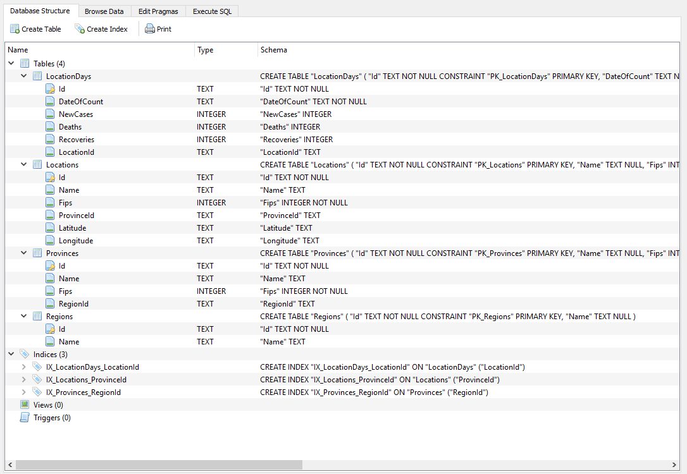

# COVID-19-DB - NOT FOR REPORTING PURPOSES

[Follow Me](https://twitter.com/CFDevelop) on Twitter for updates to this database and code.

This database is in alpha.  It should not be used for reporting. The onus is on you to validate this data.

**The database structure and code may change and there may be bugs. Please help by reporting bugs and inconsistencies in the issues section. The aim is to get this database to be as reliable as possible**

## COVID-19 SQLite Database 
This GitHub repo has C# code which generates an SQLite database based on COVID-19 figures from CSSE at Johns Hopkins University. That data can be found [here](https://www.dropbox.com/s/mgwds88ix628cgp/Covid19Db%202020-04-13.db?dl=0). This is the [Github page](https://github.com/CSSEGISandData/COVID-19).

The generated database is stored on dropbox and can be downloaded [here](https://www.dropbox.com/s/i1izgoz0uz4ow5j/Covid19Db%202020-04-12.db?dl=0).

## Why a database?
The current Johns Hopkins data is stored in CSV files and is split into daily sets. This makes it difficult to query the data over time. Databases provide a useful way to query the data with SQL. The code in this repo provides a replicable way to generate the database from the CSV files that John Hopkins provides daily. The database is currently an SQLite database, but the code allows for any database platform to generate the data. It is possible to generate the database as an SQL Server database, Oracle database, MySQL, or other database types. The code uses Entity Framework to create the database. Please change the connection string to use a different database.

## Querying the Data
Use the [DB Browser For SQLite](https://sqlitebrowser.org/) to open the database on any platform. The database structure looks like this:



The `LocationDays` table contains `LocationId`, `DateOfCount`, `Deaths`, `Recoveries`, and `NewCases`. These values can be summarized as below.

### List Top 20 Regions With Most New Cases For Last Two Weeks

```sql
select	
		Regions.Name,
		sum(newcases) as NewCasesInLastTwOWeeks
from locationdays 
inner join locations
on locations.id = locationdays.locationid
inner join Provinces
on Provinces.id = locations.ProvinceId
inner join Regions
on Regions.id = Provinces.RegionId
where 
date(DateOfCount) >= date('2020-04-11','-14 days')
AND date(DateOfCount) < date('2020-04-11')
group by 		
		Regions.Id,
		Regions.Name
order by NewCasesInLastTwOWeeks desc		
limit 20	
```

**These figures have NOT been validated. This an example only**

|Region|New Cases In Last Two Weeks|
|----------------|--------|
| US             | 394190 |
| Spain          | 92554  |
| France         | 92529  |
| Germany        | 71300  |
| Italy          | 61079  |
| United Kingdom | 59862  |
| Turkey         | 41331  |
| Iran           | 35860  |
| Belgium        | 19383  |
| Canada         | 17377  |
| Brazil         | 16221  |
| Netherlands    | 14602  |
| Switzerland    | 11623  |
| Portugal       | 11204  |
| Russia         | 10881  |
| Israel         | 7373   |
| India          | 6711   |
| Sweden         | 6616   |
| Ireland        | 5968   |
| Austria        | 5898   |

### Get Totals for Australian States

```sql
select	Provinces.Name,
		sum(newcases) as TotalCases,
		sum(deaths) as TotalDeaths,
		sum(Recoveries) as TotalRecoveries	
from locationdays 
inner join locations
on locations.id = locationdays.locationid
inner join Provinces
on Provinces.id = locations.ProvinceId
inner join Regions
on Regions.id = Provinces.RegionId
where Regions.Name='Australia'
group by Provinces.Name
```
As of 2020 - 4 - 12

Note: *Figures here highlight issues with the Johns Hopkins data. Notice that New South Wales only has 4 recoveries. This is incorrect. See the incorrect value in the Johns Hopkins data [here](https://github.com/CSSEGISandData/COVID-19/blob/master/csse_covid_19_data/csse_covid_19_daily_reports/04-12-2020.csv#L2771)*

| State                        | Confirmed | Deaths | Recoveries |
|------------------------------|-----------|--------|------------|
| Australian Capital Territory | 103       | 2      | 59         |
| External territories         | 0         | 0      | 0          |
| From Diamond Princess        | 0         | 0      | 0          |
| Jervis Bay Territory         | 0         | 0      | 0          |
| N/A                          | 4         |        |            |
| New South Wales              | 2857      | 23     | 4          |
| Northern Territory           | 28        | 0      | 2          |
| Queensland                   | 974       | 5      | 372        |
| South Australia              | 429       | 3      | 179        |
| Tasmania                     | 133       | 4      | 48         |
| Victoria                     | 1265      | 14     | 926        |
| Western Australia            | 514       | 6      | 216        |

*More examples will be added here*

## Run the Code (Generate the Database)

- Clone the [Johns Hopkins repo](https://github.com/CSSEGISandData/COVID-19).
- Modify the [launch settings](https://github.com/MelbourneDeveloper/COVID-19-DB/blob/4f27a3fa49e11a780fda1d5dbad2b616cd7d3cd6/src/Covid19DB/Covid19DB/Properties/launchSettings.json#L5) to point to the `csse_covid_19_data/csse_covid_19_daily_reports` folder of the repo
- Run the app

Alternatively, you can run the tool at the command prompt on Windows, OSX, or Linux.

- Go to the folder `src\Covid19DB\Covid19DB` (or `src/Covid19DB/Covid19DB`)
- Run 
`dotnet run C:\Code\COVID-19\csse_covid_19_data\csse_covid_19_daily_reports`

*Note: replace the folder path with your folder path*

## CSV Reader

The code is useful for anyone who wants to read the Johns Hopkins CSV files. It's easy aggregate all the files in to memory. This code loads data from the entire dataset in to memory and then filters it down to the state of Victoria, Australia and orders the data by date. It then dumps the data back out to a CSV file.

```cs
using Covid19DB.Utilities;
using System;
using System.IO;
using System.Linq;

namespace Covid19DB
{
    internal class Program
    {
        private static void Main(string[] args)
        {
            var logger = new Logger<Processor>();

            var directoryPath = args.FirstOrDefault();

            if (string.IsNullOrEmpty(directoryPath)) throw new ArgumentException("Daily Reports Directory not specified");
            
            if (!Directory.Exists(directoryPath)) throw new ArgumentException($"The directory {directoryPath} does not exist. Please check the path");

            var rows = CsvReader.ReadCsvFiles(directoryPath);

            var victoriaRows = rows.Where(r => r.Province_State == "Victoria").OrderBy(r => r.Date).ToList();
            victoriaRows.ToCsv("Victoria.csv");
        }
    }
}
```

Output:


## How  Can I Help?

The hope is that this database can be thoroughly tested and validated. The hope is that this database will help create more accurate reporting data and allow people to more readily report on the figures. The database is not ready for this. It needs rigorous validation. Please comment on the database structure and code to help make this database ready for reporting.
