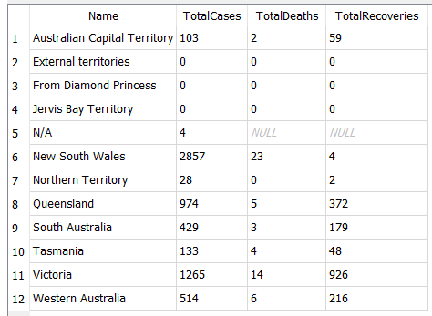

# COVID-19-DB - NOT FOR REPORTING PURPOSES

This database is in alpha. It contains errors. It should not be used for reporting. Do not publish data from this database.

*The database structure and code will change. Please do not rely on anything remaining the same

## COVID-19 SQLite Database 
This GitHub repo has C# code which generates an SQLite database based on COVID-19 figures from CSSE at Johns Hopkins University. That data can be found [here](https://github.com/CSSEGISandData/COVID-19/tree/master/csse_covid_19_data/csse_covid_19_daily_reports). This is the [Github page](https://github.com/CSSEGISandData/COVID-19).

The generated database is stored on dropbox and can be downloaded here.
https://www.dropbox.com/s/mgtkw5x6o5ppnxi/Covid19Db.db?dl=0

## Why a database?
The current John Hopkins data is stored in CSV files and is split into daily sets. This makes it difficult to query the data. Databases provide a useful way to query the data with SQL. The code in this repo provides a replicable way to generate and update a database from the CSV files that John Hopkins provides daily. The database is currently an SQLite database, but the code allows for any database platform to generate the data. It is possible to generate the database as an SQL Server database, Oracle database, MySQL, or other database types. The code uses Entity Framework to create the database. Please change the connection string to use a different database.

## Basic Queries
Use the [DB Browser For SQLite](https://sqlitebrowser.org/) to open the database on any platform. The database structure looks like this:


The `LocationDays` table contains `LocationId`, `Date`, `Deaths`, `Recoveries`, and `NewCases`. The location "EEC1C1C5-179A-4050-BFA6-54F26206E7D3" represents anywhere in Victoria, Australia. To summarise all recoveries, run this query:

```sql
select sum(recoveries) from locationdays 
where locationid = 'EEC1C1C5-179A-4050-BFA6-54F26206E7D3' 
```



## How  Can I help?

The hope is that this database can be thoroughly tested and validated. The hope is that this database will help create more accurate reporting data and allow people to more readily report on the figures. The database is not ready for this. It needs rigorous validation. Please comment on the database structure and code to help make this database ready for reporting.